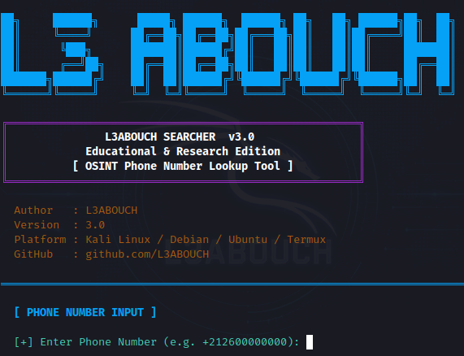
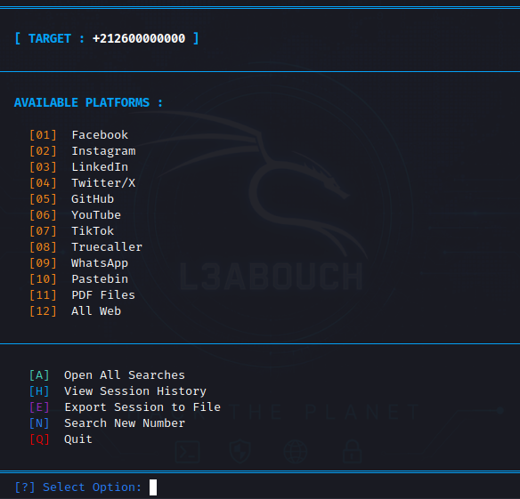

<div align="center">

```
██╗     ██████╗      █████╗ ██████╗  ██████╗ ██╗   ██╗ ██████╗██╗  ██╗
██║     ╚════╝      ██╔══██╗██╔══██╗██╔═══██╗██║   ██║██╔════╝██║  ██║
██║      ╚███╗      ███████║██████╔╝██║   ██║██║   ██║██║     ███████║
██║      ╔══╝██╗    ██╔══██║██╔══██╗██║   ██║██║   ██║██║     ██╔══██║
███████╗██████╔╝    ██║  ██║██████╔╝╚██████╔╝╚██████╔╝╚██████╗██║  ██║
╚══════╝╚═════╝     ╚═╝  ╚═╝╚═════╝  ╚═════╝  ╚═════╝  ╚═════╝╚═╝  ╚═╝
```

# L3ABOUCH SEARCHER

**Educational OSINT Phone Number Lookup Tool**

[](https://www.python.org/)
[](https://github.com/l3abouch/L3ABOUCH-Searcher)
[](LICENSE)
[](https://github.com/l3abouch/L3ABOUCH-Searcher/releases)
[](https://github.com/l3abouch/L3ABOUCH-Searcher/stargazers)

*A fast, lightweight, cyber-styled terminal tool for Google-based OSINT research across public platforms.*

</div>

---

## 📸 Screenshots

<div align="center">

| 🏠 Home Screen — Banner & Phone Input | 🔍 Search Menu — Platform Selection |
|:-------------------------------------:|:------------------------------------:|
|  |  |

</div>

---

## ✨ Features

| Feature | Description |
|---------|-------------|
| 🔎 **Multi-Platform Search** | Query 12+ public platforms in one session |
| 📱 **Phone Validation** | E.164-compatible input validation with helpful errors |
| 📂 **Session Export** | Save your research session to a timestamped `.txt` report |
| 📝 **Search History** | Review every search performed in the current session |
| ⚙️ **Config File** | Fully editable `config.json` — add platforms without touching source code |
| 📋 **Auto-Logging** | Daily rotating log files written to `logs/` automatically |
| 🌀 **Animated Spinner** | Visual feedback while browser tabs open |
| 📐 **Responsive Layout** | Adapts to your terminal width — wide desktop or narrow Termux |
| 🐍 **Pure Python** | Zero external dependencies — stdlib only |
| 🐧 **Cross-Platform** | Kali Linux · Debian · Ubuntu · Termux |

---

## 📦 Installation

### Kali Linux / Debian / Ubuntu

```bash
git clone https://github.com/l3abouch/L3ABOUCH-Searcher.git
cd L3ABOUCH-Searcher
python3 l3abouch.py
```

### Termux (Android)

```bash
pkg update && pkg install git python
git clone https://github.com/l3abouch/L3ABOUCH-Searcher.git
cd L3ABOUCH-Searcher
python l3abouch.py
```

> **Termux note:** The tool auto-detects Termux and uses `termux-open-url` to open search results in your browser. No extra configuration needed.

---

## ⚙️ Requirements

- Python **3.9** or higher
- An active internet connection
- A modern web browser installed
- No third-party packages required

---

## 🗂️ Project Structure

```
L3ABOUCH-Searcher/
│
├── l3abouch.py          # Main script — single-file, drop-in
├── config.json          # Auto-generated on first run; fully editable
├── README.md
├── LICENSE
│
├── logs/                # Auto-created — daily rotating session logs
│   └── YYYY-MM-DD.log
│
├── exports/             # Auto-created — timestamped session exports
│   └── session_YYYYMMDD_HHMMSS.txt
│
└── images/
    ├── home.png
    └── menu.png
```

---

## 🧭 Usage

Run the script and follow the on-screen menu:

```
[01]  Facebook        [07]  TikTok
[02]  Instagram       [08]  Truecaller
[03]  LinkedIn        [09]  WhatsApp
[04]  Twitter/X       [10]  Pastebin
[05]  GitHub          [11]  PDF Files
[06]  YouTube         [12]  All Web

[A]  Open All Searches
[H]  View Session History
[E]  Export Session to File
[N]  Search New Number
[Q]  Quit
```

### Keyboard shortcuts

| Key | Action |
|-----|--------|
| `1`–`12` | Open that platform in your browser |
| `A` | Open all platforms at once |
| `H` | Show in-session search history |
| `E` | Export session to `exports/` |
| `N` | Start a new phone number search |
| `Q` | Quit (auto-exports if history exists) |
| `Ctrl+C` | Safe interrupt → clean exit |

### Customising platforms

Edit `config.json` to add, remove, or reorder platforms without changing source code:

```json
{
  "platforms": [
    { "name": "Facebook",  "query": "\"{phone}\" site:facebook.com" },
    { "name": "MyCustom",  "query": "\"{phone}\" site:example.com" }
  ],
  "search_engine": "https://www.google.com/search?q=",
  "tab_delay": 0.40,
  "log_enabled": true
}
```

---

## 🔒 Privacy & Ethics

This tool performs **Google-based searches only** — it does not contact any phone carrier, social network API, or third-party data broker. Every query is constructed as a standard Google search URL and opened in your local browser.

**Intended use cases:**

- Security researchers verifying data exposure
- Penetration testers in authorized engagements
- Individuals checking their own digital footprint
- Cybersecurity students and educators

**Not intended for:** surveillance, harassment, stalking, or any activity that violates applicable laws or platform terms of service.

---

## ⚠️ Disclaimer

> This project is provided **for educational, research, and defensive security purposes only.**
>
> The author is not responsible for any misuse of this software. Users are solely responsible for ensuring their use complies with all applicable local laws, regulations, and the terms of service of any platform accessed through this tool.

---

## 👨‍💻 Author

<div align="center">

**L3ABOUCH**

[](https://github.com/l3abouch)
[](https://instagram.com/l3abo_uch)
[](https://youtube.com/@l3abouch)

</div>

---

## 📜 Changelog

| Version | Highlights |
|---------|-----------|
| **3.0** | `config.json` support · daily logs · session export · `[H]` history · spinner · responsive layout · Termux browser fix · unified quit |
| **2.0** | Multi-platform search · colored UI · menu loop · phone validation |
| **1.0** | Initial release |

---

## 🗺️ Roadmap

- [ ] `--phone` CLI argument for scripting / automation
- [ ] DuckDuckGo / Bing as alternate search engines (via config)
- [ ] JSON export format for machine-readable sessions
- [ ] Inline log viewer `[L]` menu option
- [ ] Plugin system — drop a `.json` into `plugins/` to add platforms
- [ ] Results deduplication within a session

---

<div align="center">

If this project helped you, consider giving it a ⭐ on GitHub.
It helps others discover the tool and motivates future development.

[](https://github.com/l3abouch/L3ABOUCH-Searcher)

</div>
